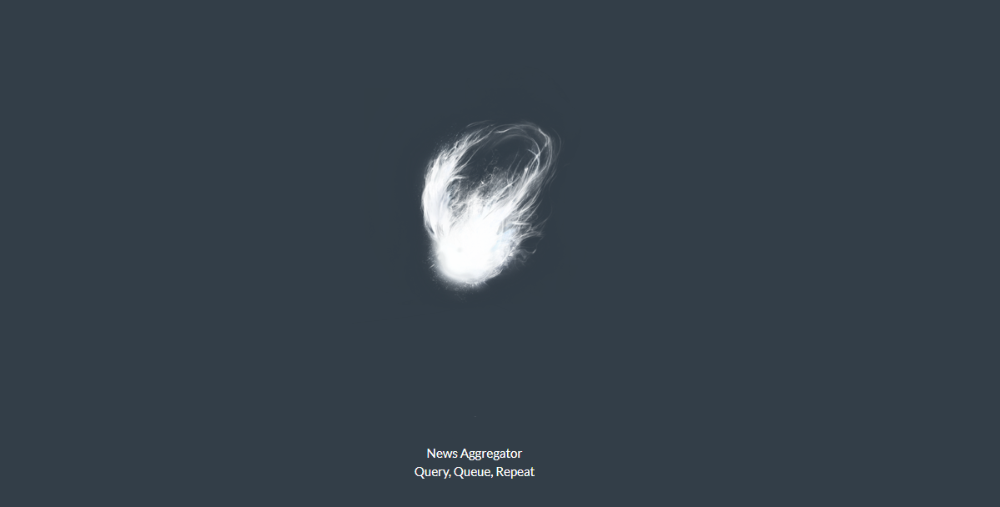
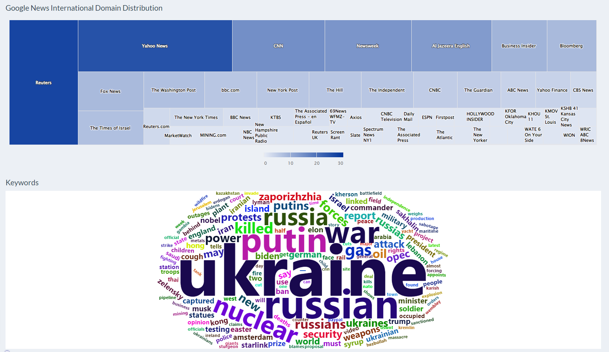

# News Aggregator

       

News Aggregator is n R/Shiny app that gathers news articles on specified topics from multiple sources and presents all this information in an easily browsable and digestible format. This enables staying informed on the chosen topics easier and quicker.
## Features:
The articles are retrieved using RSS feeds and REST APIs and are arranged into specified categories and subcategories. For major news categories from Google News, it is possible to see and compare news articles from different organizations about the same news topic together. 

This gives the ability to easily analyze the presentation of the same topic from different sources.The review functionality lets the user mark and records a specific news article in different categories (exemplary, clickbait, sloppy and malicious). This lets the user keep track of the quality of a given news source. 

Several news categories also contain an overview page. This overview page lets the user see the number of news pieces per source as well as the keywords used in articles in order to see the level of variability in organizations displayed by Google News. The keyword analysis and visualization located on this page let the user get a sense of which topics are being presented and with which frequency.

In addition to the core functionalities mentioned above the app also enables the custom search of given topic(s) via Google News search located in the left-handbar or via importing an XLSX file (an example of this is added with the file name TestSources.xlsx in the data folder) with news sources saved. Additionally, the search frequency, location and related searches can be seen fromGoogle Trends using the related search bar.
## Dependencies: 

The application uses22 packages with 77 unique and 171 total dependencies. Because of this, errors surface regularly due to the packages or their dependencies being updated. However, it is possible to create a stable environment for this application using ['Packrat'](https://cran.r-project.org/)package in order to install specific versions of the packages for a given project. Information on this package can be found ['here'](https://rstudio.github.io/), and the list of packages, dependencies, session Information, and version of packages can be found in AdditionalInformation folder.

## Issues:
- Since this was a project used to learn Shiny from scratch, many of the modules used contain code that is bad practices for reactive programming, which make the app slower. However, the level of slowness is not a significant issue for the personal use of this app from localhost. 
- Some RSS feeds are discontinued as time passes and these feeds need to be removed from the app code to not affect the visual quality of the app.